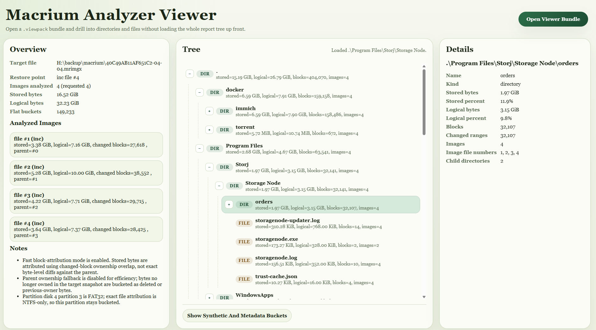

# Macrium Analyzer

Macrium Analyzer is a local Windows-first tool for attributing the size of a Macrium Reflect `.mrimgx` restore point to the files and directories that own the changed blocks stored in that image.

The current implementation supports both single-image and multi-image aggregate analysis for NTFS-backed restore points. It keeps canonical aggregate state in memory while a run is active, writes durable text and viewer-bundle outputs, produces a directory-oriented view of contribution, and keeps filesystem metadata and unresolved ownership visible instead of silently dropping them.

## What It Does

- parse Macrium Reflect X `.mrimgx` metadata and block indexes directly
- resolve changed blocks for a selected restore point within its backup set
- attribute stored backup bytes to current NTFS owners at file and directory level
- aggregate stored-byte impact across a selected restore-point window
- keep SQLite aggregate state in memory during the run
- write both flat attribution buckets and hierarchical directory rollups
- emit a `.viewpack` bundle for the local static viewer
- emit a JSON progress file plus an append-only progress log while analysis runs

## Current Limitations

- encrypted backups are not supported
- full-backup attribution is not supported yet
- rename/move identity across a backup chain is still unresolved
- non-NTFS partitions are surfaced in partition-level buckets instead of exact file attribution

## Quickstart

1. Install the package in editable mode:

```powershell
python -m pip install -e .
```

2. Analyze a restore point:

```powershell
macrium-analyzer analyze-mrimgx `
  --file "D:\Backups\34EEA0E7CD73CF00-24-24.mrimgx" `
  --image-count 4 `
```

3. Launch the html viewer and load the viewpack:

- `viewer\index.html`
- `34EEA0E7CD73CF00-24-24.analysis.viewpack`



## Output Shape

The tool writes:

- a human-readable text report
- a `.viewpack` bundle for the viewer

SQLite remains the canonical aggregate state during analysis, but it is kept in memory by default rather than written as a durable user-facing artifact.

The text report focuses on:

- largest directories
- most specific impactful directories
- a condensed directory tree
- synthetic buckets for filesystem metadata and unresolved ownership

The viewer bundle is intended for the committed local static viewer in `viewer/`, which reads the bundle lazily instead of parsing the full JSON report in-browser.

## Format References

This repo does not vendor the upstream Macrium format-reference project.

- upstream reference project: `https://github.com/macriumsoftware/mrimg_file_layout`
- local notes about external references: `docs/REFERENCES.md`

## Roadmap

- resumable analysis built on top of the SQLite state database
- performance and parallel-processing design work for faster large-chain analysis
- richer viewer drill-down and search within the local static HTML viewer
- deeper handling for metadata-heavy NTFS buckets such as `$MFT`, `$LogFile`, and `$UsnJrnl`
